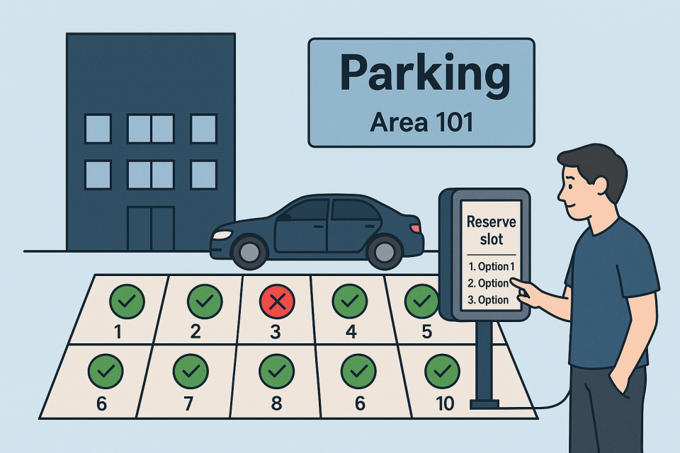

# Parking App

## Project Description

A console application that manages customer registration, parking spot availability and parking spot reservations.
Customer information is stored in a list of reservations.
Parking spots are stored in a list of 10 spots that can be reused.

## User Experience

First the customer sees the welcome menu with the options to create a reservation, view available spots,
manual checkout or exit the application.

When a customer choose to create a new reservation they are asked to enter their information by inputting name,
phone number and vehicle license plate number. then view a list of available
parking spots to choose from. When the customer selects a parking spot they can enter for how long duration of time
they want to reserve the spot. A reservation always start from the moment the customer creates the reservation.
Future booking of starting time is not possible.

## test

## test
